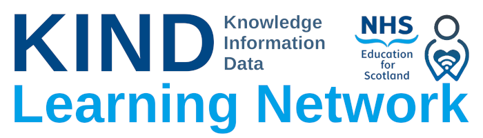

 Introductory Shiny
================
Brendan Clarke
2023-04-11

# Introductory Shiny

## Introduction

This training course in an introduction to Shiny. It is aimed at data analysts working in health, care, and housing. 

The training is designed for analysts who are already fairly comfortable working in R, but without any prior Shiny experience. While the expectations are fairly low - you absolutely don’t need to be an R
expert to successfully complete this training - you should have some previous experience using R. As the course has a tidyverse flavour, trainees should have some familiarity with using core tidyverse
functions (dplyr and ggplot especially).

If you're new to R, we would suggest enrolling on our [Introductory R and Rmarkdown](https://learn.nes.nhs.scot/62249) course before undertaking this Shiny training.

## What this training will cover

This course will cover the basics of building a simple dashboard in Shiny. 

## Course format

## Getting started

### Requirements
### Joining instructions
#### Step-by-step instructions

1.  Go to <https://rstudio.cloud/>
2.  If you have an account, you can log in as normal. Otherwise, please
    create a new account by selecting Get started for free, following
    the steps, and then signing-in
3.  Once you’ve signed-in to Posit Cloud, add a new project by clicking
    New Project \>\> New Project from a Git repository. When prompted,
    enter the URL <https://github.com/bclarke-nes/KIND-shiny-intro> for
    this training
    

## Aims and objectives

### Aims

- To introduce a series of R/tidyverse tools that are particularly
  helpful to analysts moving beyond R basics
- To provide a social learning space to support learners as they develop
  their skills into these more challenging areas
- To show how more advanced R techniques can be used in real-world data
  analysis in health and social care

### Objectives

By the end of these session, the user should:

- Have developed their understanding of functions, iteration, dplyr,
  purrr, and tidyevaluation
- Have connected these new functions to their own work
- Have participated in social learning during the training sessions,
  reviewing the code of other trainees
- Have confidence in reading third-party code that uses some of these
  advanced R techniques
