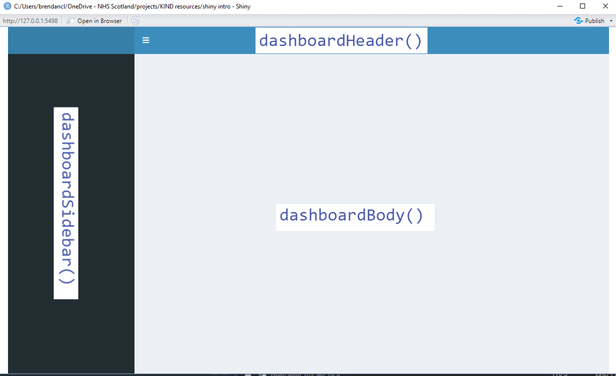

## Session learning outcomes

+ thinking about UI design using `shinydashboard`
+ outsourcing more complicated R code to a script

## Let's start with a blank(ish) script again
  
(MILESTONE 1)

## Basic UI infrastucture

+ `shinydashboard` boilerplate

```{verbatim}
dashboardPage(
    dashboardHeader(),
    dashboardSidebar(),
    dashboardBody()
  )
```
{fig-align="center"}

(MILESTONE 2)

## `shinydashboard`

+ `dashboardPage()`
  + `dashboardHeader()`
  + `dashboardSidebar()`
  + `dashboardBody()`
    + `box()`

We're going to work within the `dashboardBody()` today, and leave the header and sidebar for next time.

(MILESTONE 3)

## Data sources

With that UI framework in place, we can start thinking about building a dashboard to use real data: 

+ [PHS delayed discharge bed days by health board](https://www.opendata.nhs.scot/dataset/52591cba-fd71-48b2-bac3-e71ac108dfee/resource/fd354e4b-6211-48ba-8e4f-8356a5ed4215/)
+ [PHS health board names and geography codes](https://www.opendata.nhs.scot/dataset/9f942fdb-e59e-44f5-b534-d6e17229cc7b/resource/652ff726-e676-4a20-abda-435b98dd7bdc)
+ [PHS population estimates](https://www.opendata.nhs.scot/dataset/7f010430-6ce1-4813-b25c-f7f335bdc4dc/resource/27a72cc8-d6d8-430c-8b4f-3109a9ceadb1)

Let's look at the DD data now to see what we're likely to need

## DD data architecture

+ HBT
+ AgeGroup
+ Number


## Getting the data

+ there's a data-processing script in `/R/s03_data.R` that downloads and tidies the data for us. This makes four .rds data files from the open data:
  + `data/data.rds` - the main delayed discharge data
  + `data/boards.rds` - a tibble of board names and codes
  + `data/standardised_data.rds` - delayed discharges per capita for the territorial NHS boards
  + `data/standardised_data_national.rds` - delayed discharges per capita, national
+ we'll call that script from `R/s03.R`, which will also hold our functions

## Producing outputs

+ the aim is to do most of the processing in an R script, and just call the relevant parts from `server()`
+ lots of messing around with paths in Shiny: highly recommend `here()` / `i_am()`
+ please create `R/s03.R`
  + create a vector of paths for the four `data/*.rds`
  + add some code to check that all four exist
    + if so, please load them to corresponding tibbles (so `data/data.rds` -> `data`)
    + if not, please `source()` the `s03_data.R` script
    

(MILESTONE 04)

## Building a graph function

Now we'll need to build some `ggplot` to:

+ filter `data` for one health board
+ plot the `Total` against `MonthOfDelay`

(MILESTONE 05)

+ try testing this code now in `s03.R`
+ once it's working, you should create a `discharge_graph` function from it:
  + argument - board name
  + return - appropriate graph. 
  
The first step is to create an empty function called  that takes a single argument...

(MILESTONE 06)

Once we've got that set-up, we can insert the `ggplot` code, and adapt as appropriate. 

+ No need to {{embrace}} the argument

(MILESTONE 07)

Once we've got this in place (and tested) we can do a bit of beautifying:

(MILESTONE 08)

`glue()` is very helpful for making appropriate labels.

## Changes in `ui()`

We can now put the appropriate elements into the UI

+ a couple of `fluidRow()`s, containing
  + a `box()` with a `selectInput()` for the boards
  + a `plotOutput()` for our graph

(MILESTONE 08)

## Changes in `server()`

+ `isolate()`, which is a way of safely `source()`-ing scripts inside `server()`
  + useful explanation from [the Shiny manual](https://shiny.rstudio.com/articles/isolation.html)
+ the single function call to `delayed_discharge()` with appropriate `input$x`

(MILESTONE 09)


## Developing the script

(we're pretty-well back to the starting demo dashboard from session 1 here, so congratulations!)

With the eventual aim of developing the full dashboard, we'll now add three more functions to `s03.R`:

+ `compare_boards()` - to compare DD counts between boards
  + three arguments: boards, age, date_range
+ `stand_compare_boards()` - to compare DD rates between boards
  + three arguments: boards, age, scot
+ `comp_map()` - to map DD rates relative to national average
  + three arguments: month_r, age, comp

(MILESTONE 10)

(MILESTONE 11)

(MILESTONE 12)

## Next time!

+ `shinydashboard` menu and sections
+ adding those new functions as pages in our dashboard
+ tweaks, tidying up, and story-telling
+ thinking about project architecture